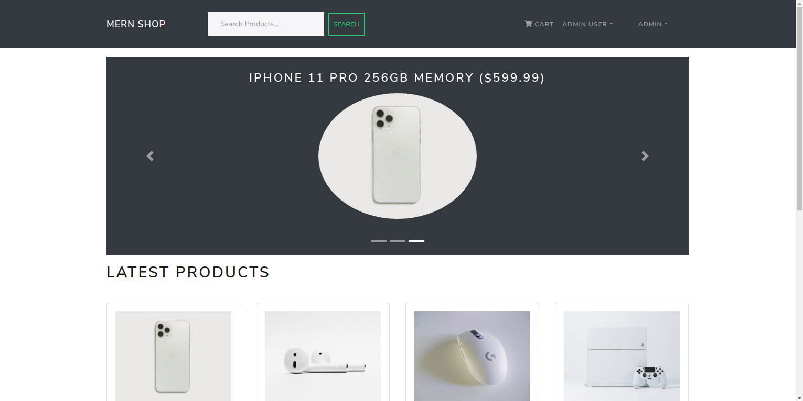
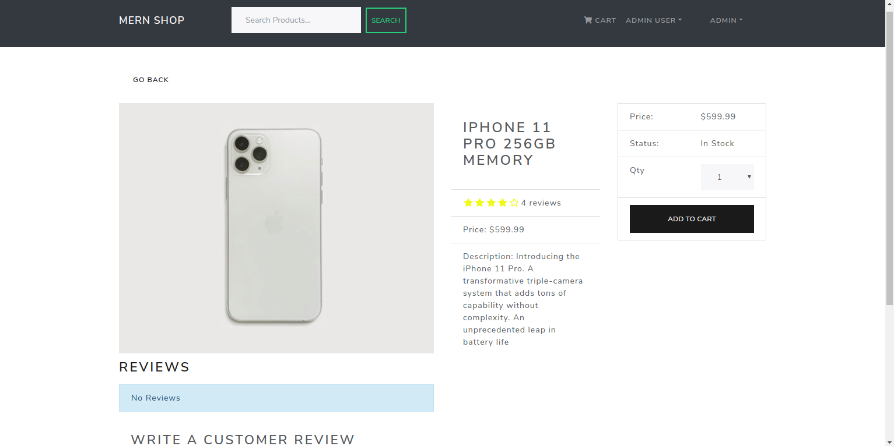

This is a fully functioning Ecommerce application modeling tech/electronics website!
---------------------------------
Built from scratch using React, Redux, Express, Node, and MongoDB.

Some features as seen in the images below include a fully integrated shopping cart & checkout process with Paypal, specific payment and delivery options, a 4-step checkout process, product searching, admin functionality to manage users, orders, and products, and product pagination!

Check out the page and interact with it yourself!

https://mernecommapp.herokuapp.com/

---------------------------------

---------------------------------

---------------------------------

---------------------------------

